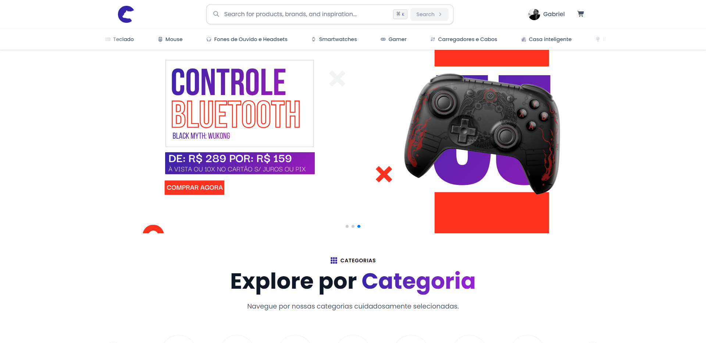
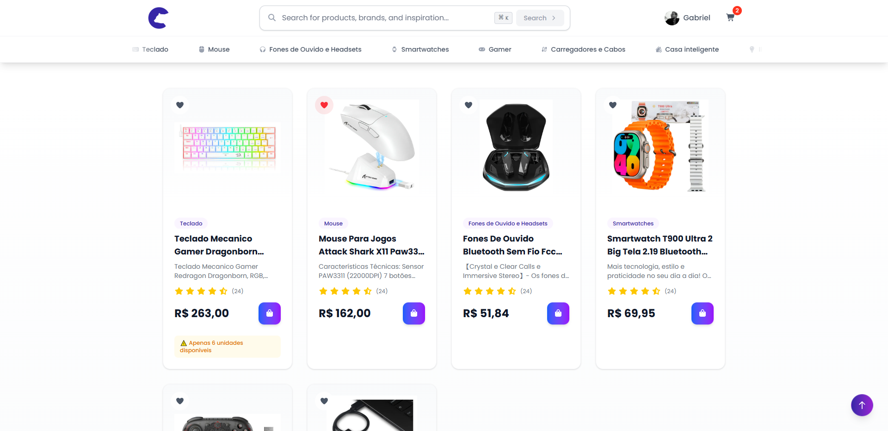
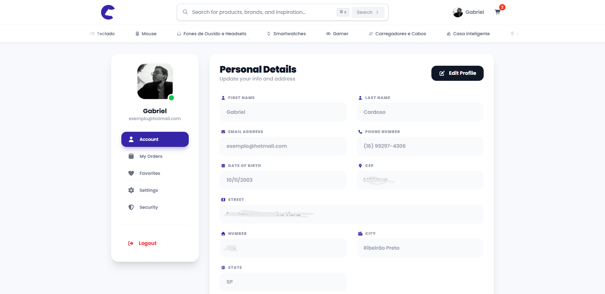

<div align="center">
  
</div>

---

<h1 align="center"> IPolar - E-commerce</h1>

> [!NOTE]
> <h3>🏗️ STATUS: em construção 🚧</h3>
---

<h2 align="center">📖 Sobre</h2>

<p align="left">O <strong>IPolar</strong> é uma plataforma de e-commerce de alto desempenho desenvolvida para o setor de periféricos e tecnologia. O projeto foca em entregar uma experiência de usuário (UX) excepcional através de uma interface moderna e funcionalidades avançadas de engenharia de software. A aplicação conta com um sistema de autenticação robusto via <strong>JWT</strong>, gerenciamento de estado global sincronizado entre abas e uma arquitetura baseada em eventos para atualizações em tempo real do carrinho e perfil do usuário. Além disso, implementa navegação dinâmica via API, atalhos de produtividade no teclado e uma interface 100% responsiva, garantindo que o fluxo de compra seja ágil, seguro e intuitivo em qualquer dispositivo.</p>

---

<h2 align="center">✔ O projeto contém:</h2>

✅ Autenticação JWT<br>
✅ Sincronização Multi-Aba<br>
✅ Busca Inteligente<br>
✅ Carrinho Dinâmico<br>
✅ Consumo de API<br>
✅ User Experience Premium<br>
✅ Navegação Fluida<br>
✅ Área do Cliente<br>

---

<h2 align="center" >🚀 Instalando</h2>

## Clone o repositório
```
git clone https://github.com/gabriell-c/ecommerce_frontend.git
```

## Instale as dependências

```
npm install
```

## E logo em seguida:
```
npm run dev
```

O projeto vai ser iniciado em http://localhost:5173


<h2 align="center">💻Preview</h2>

</img>
<br>
<br>
</img>
<br>
<br>
</img>
<br>
<br>


---

<h2 align="center">🛠 Tecnologias usadas</h2>
<div align="center" >
    
    
    
    
    
    
    
</div>

---

<h2 align="center">📝Licença</h2>

<p align="center">
   Este repositório está sob licença MIT. Você pode ver o arquivo <a href="https://github.com/gabriell-c/ecommerce_frontend/blob/main/LICENSE"> LICENSE</a>
   para mais detalhes. 😉
</p>
